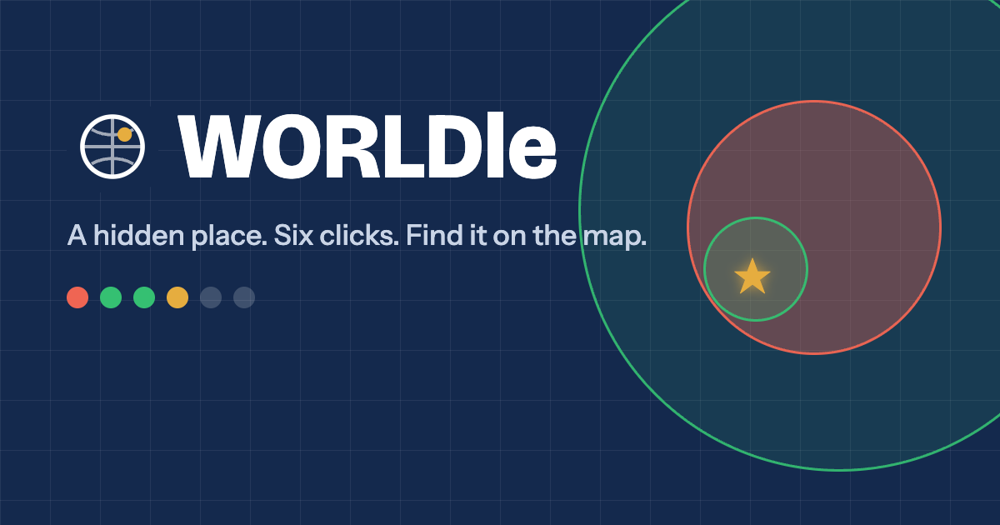

[](https://worldle.world)
[](https://worldle.world)
[](https://github.com/brianfunk/worldle/releases)
[](https://github.com/brianfunk/worldle/actions/workflows/ci.yml)
[](https://app.netlify.com/sites/worldleworld/deploys)
[](https://github.com/ellerbrock/open-source-badge/)
[](http://semver.org/spec/v2.0.0.html)
[](https://opensource.org/licenses/MIT)
[](https://www.linkedin.com/in/brianrandyfunk)

<p align="center">
  <a href="https://worldle.world"></a>
</p>

<h1 align="center">WORLDle</h1>

<p align="center"><b>A hidden place. Six clicks. Find it on the map.</b><br>
Play at <a href="https://worldle.world">worldle.world</a></p>

A geographic take on Wordle. A hidden place is somewhere on the map and you have six clicks to find it.
Every click draws a ring around the spot you clicked: **green** if the place is inside, **red** if not.
Rings shrink as you go, each click reveals another clue, and clicking close enough to the place wins.



- **Daily puzzle**: everyone gets the same place each day, seeded from the date. The first clue is shown before you click.
- **Archive**: every past day is playable from the calendar button, with your result shown next to each one.
- **Map modes**: Easy (place names and a compass bearing), Hard (satellite, no labels, no compass), Random (a surprise basemap). Switch any time, even mid-game.
- **Miles or kilometres**: defaults from your locale, one tap to switch.
- **Remembered in your browser**: your map preference, unit, in-progress clicks (a refresh does not lose the game) and finished results live in localStorage. No accounts, no server, no database.
- **120 places**: landmarks, cities and natural wonders across every continent.

Static site: Vite + React + TypeScript, [MapLibre GL](https://maplibre.org/) for the map, free tiles from
[OpenFreeMap](https://openfreemap.org/), OpenStreetMap, OpenTopoMap, CARTO and Esri. No server.

## Run it

```sh
nvm use            # Node 22+
npm install
npm run dev        # http://localhost:5173
npm test           # engine, daily seed and share-text tests
npm run build      # production build in dist/
```

Handy URL params while developing:

- `?d=42` opens daily puzzle number 42 (day 1 is 1 Sep 2026; future days are not reachable).
- `?map=osm` forces a basemap (Easy uses `bright`, Hard uses `imagery`). Ids: `bright`, `liberty`, `positron`, `osm`, `opentopo`, `voyager`, `darkmatter`, `imagery`, `natgeo`, `streets`.

## How the game decides things

All rules live in `src/game/engine.ts` as pure functions with constants at the top:

| Constant | Default | Meaning |
| --- | --- | --- |
| `MAX_GUESSES` | 6 | Clicks per game |
| `RADIUS_FACTOR` | 3 | Circle radius is this many times the distance to the place |
| `MIN_RADIUS_KM` | 25 | Smallest circle drawn |
| `MAX_RADIUS_KM` | 5000 | Largest circle, used before any green hit |
| `SHRINK` | 0.5 | Each later circle is at most this fraction of the current green one |

A click wins when it lands within the target's own `winRadiusKm`. Clicks outside the latest green circle
or inside a red one are rejected with a toast and do not use a guess. Games are stored as the list of clicks and
replayed through the engine on load (`replay` in `engine.ts`), so saved data stays tiny and rule changes apply retroactively.

Browser storage keys (`src/game/storage.ts`): `worldle.prefs.v1`, `worldle.progress.v1`, `worldle.results.v1`.

The daily pick (`src/game/daily.ts`) shuffles the target list once with a fixed seed and walks through it one
per day, so adding places to the end of the list does not change past days.

## Adding a place

Edit `src/game/targets.json`. Each entry:

```json
{
  "id": "eiffel-tower",
  "title": "Eiffel Tower",
  "category": "landmark",
  "lon": 2.2945,
  "lat": 48.8582,
  "winRadiusKm": 2,
  "hints": ["vague clue", "...", "most specific clue"],
  "fact": "Shown on the result card."
}
```

`category` is `landmark`, `city` or `nature`. Six hints, ordered vague to specific. Typical win radii:
landmarks 2 to 5 km, cities 12 to 20 km, natural wonders 15 to 100 km depending on size.

## Branching

`dev` is the default branch. Branch off `dev` for any change (`feature/...`, `fix/...`), open a pull request back into
`dev`, and promote `dev` to `main` with a PR when it is ready for production. Netlify can build `main` as production
and `dev` as a branch deploy for previews.

## Releasing

1. Bump `version` in `package.json` on a branch off `dev` and merge it.
2. Open a PR from `dev` to `main`. Merging it is the production release.
3. Tag it: `git tag v1.1.0 && git push origin v1.1.0`, then create a GitHub release from the tag.

## Deploy

`netlify.toml` builds with `npm run build` and publishes `dist/`. Link the repo to a Netlify site and every push
to `main` deploys. For a one-off: `netlify deploy --build --prod`.

## Legacy

The original 2022 prototype (Express server, OpenLayers, jQuery) is kept unchanged in `archive/legacy/` for reference.
